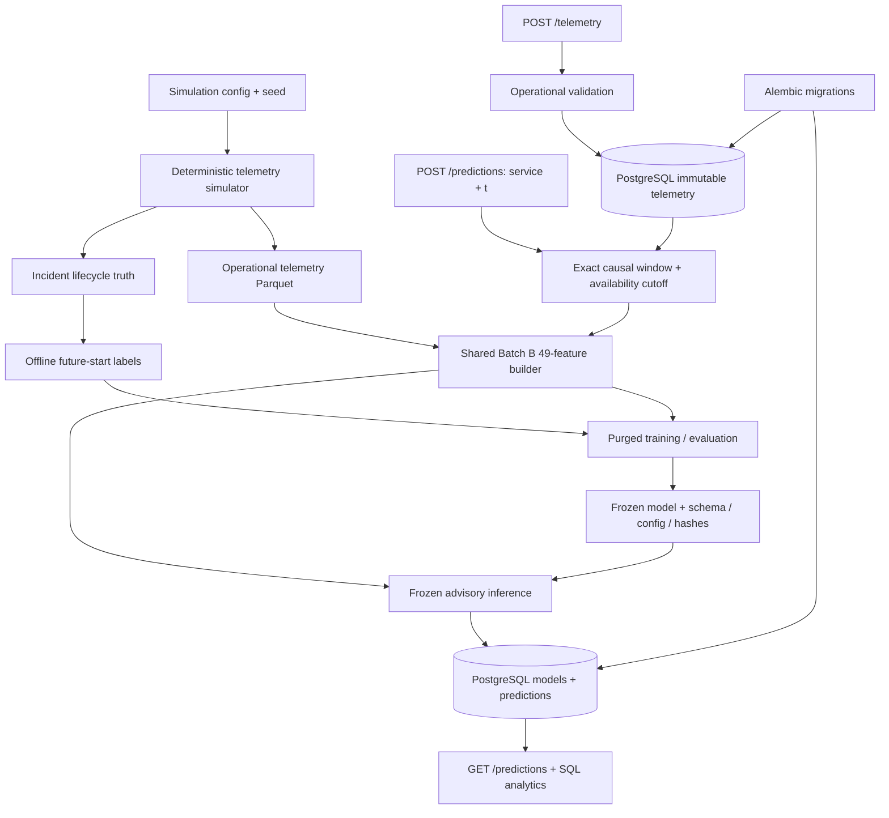

# Reliability Intelligence Platform

A production-style software/ML engineering project for estimating whether a service will
**enter an incident within the next 10 minutes**, using its most recent **15 minutes of
available telemetry**.

**Current status: Batch C serving and PostgreSQL persistence locally accepted. Native and
clean-volume Docker Compose validation passed, including all 205 tests with zero skips.**
The package generates validated synthetic telemetry, builds causal features, evaluates frozen
models and serves durable advisory predictions. The changed schedule regime exposes substantial
performance loss; synthetic feasibility is not real-world forecasting validity. See the
[Batch C acceptance record](docs/BATCH_C_COMPLETION.md) for the completed local gates and remaining limitations.

## Why this exists

Useful incident prediction requires trustworthy temporal data, defensible targets, reliable
software and operational evaluation. The foundation and ML workflow make those assumptions inspectable
through reproducible data and controlled evaluation. The final system will support on-call investigation with calibrated
risk, durable predictions and monitoring; see [the project vision](PROJECT_VISION.md).

## Current architecture



Inference-time fields are strictly separate from incident metadata and future labels.
Starts in `(t, t+10m]` count as positives. Incomplete future coverage produces null targets,
not negatives. The separate ML workflow builds only allowlisted operational features; truth never enters predictors.

## Setup

Use **Python 3.14**. This is the only Python series currently targeted and validated.
Run from the repository root:

```bash
python3.14 -m venv .venv
source .venv/bin/activate
python -m pip install -r requirements-lock.txt
python -m pip install --no-deps --no-build-isolation -e '.[dev]'
```

`requirements-lock.txt` is the exact validated dependency/build-tool snapshot. The package also
has bounded dependency ranges in `pyproject.toml`; upgrading that snapshot requires revalidation
and regenerated evidence. The lock is version-pinned, not a wheel/hash lock for every platform.
Offline workflows require no secrets. Local serving uses environment configuration; keep `.env` ignored.

## Generate telemetry

```bash
reliability generate --config configs/batch_a.json --output data/my_run
```

The default is 48 hours at one-minute sampling, seed 42, with api-gateway, auth-service,
catalog-service and search-service. It produces 11,520 telemetry rows, 16 incidents and
11,520 label rows. Use a new output directory for each run: existing runs are never overwritten.
`python -m reliability_intelligence` is an equivalent entry point.

Configuration, scenario equations and schedule examples: [simulation guide](docs/SIMULATION.md).
Fields, units, interval boundaries and target eligibility: [data contract](docs/DATA_CONTRACT.md).

## Reproduce evidence

```bash
reliability evidence --dataset data/my_run --output evidence/my_run
```

Open `evidence/my_run/REPORT.md`. The command verifies dataset hashes before generating plots
for normal behaviour and each available scenario, incident counts, distributions, class balance,
correlations and phase summaries. It uses the earliest event of each type, not manually selected
favourable examples. Evidence output must also be a new directory.

The delivered reference report is [Batch A evidence](evidence/batch_a/generated/REPORT.md).
Its local raw bundle is `data/batch_a/`; raw generated runs are Git-ignored and reproducible from
configuration. The small reference plots/reports are intended for version control.

## Batch B: reproduce ML and evaluation

```bash
reliability batch-b --config configs/batch_b.json --corpus data/batch_b --output data/batch_b_experiment --evidence evidence/batch_b/generated
```

This command generates or strictly verifies/reuses seven independent four-day bundles (846
incidents, 161,280 rows), fits training-only prevalence/logistic/boosting candidates, compares
calibration and selects thresholds on separate chronological stages, then scores frozen choices.
Use unused experiment/evidence paths on repeat runs. Raw corpus, model binaries and all keyed
predictions are Git-ignored; compact configuration, tables, five plots and hashes are committed.

To regenerate evidence from saved predictions without fitting:

```bash
reliability batch-b-evidence --experiment data/batch_b_experiment --output evidence/batch_b/repeated
```

Start with [the generated Batch B report](evidence/batch_b/generated/REPORT.md),
[feature contract](docs/FEATURE_CONTRACT.md), [evaluation protocol](docs/EVALUATION_PROTOCOL.md)
and [completion/checklist](docs/BATCH_B_COMPLETION.md). Raw boosting was selected. Its temporal-test
AP is 0.8800795523231142 and changed-regime AP is 0.4512755938169232. Final false-alert frequencies
exceed the validation budget, so the selected threshold is an experimental reference, not a
production operating recommendation. Always-on baselines expose an episode-budget weakness;
alert burden must accompany detection/episode precision.

## Batch C: local API and PostgreSQL

Start with [the serving runbook](docs/SERVING.md): migrations, database/API contracts,
event-time versus ingestion-time semantics, frozen artefact configuration and Docker Compose
commands. The API reuses the original Batch B feature builder and model, with no retraining.

- `GET /health/live`, `GET /health/ready`
- `POST /telemetry` (atomic batches; identical retries are no-ops, conflicts fail)
- `POST /predictions` (201 new / 200 saved retry; advisory decision and trace metadata)
- `GET /predictions` (service/time filters; `limit=1` for latest)

[Committed local evidence](evidence/batch_c/reference/REPORT.md): 184 telemetry samples,
121 stored predictions with **exact parity across all 49 float64 features and probabilities**,
and an eight-client concurrency exercise. New predictions had local p50 **84.00 ms** and p95
**116.58 ms**. These loopback measurements establish neither a production SLO nor model validity.
Historical event-time requests use data available at the recorded scoring cutoff; they do not
claim that late-arriving inputs were known at historical t.

[Docker Compose acceptance](evidence/batch_c/COMPOSE_VALIDATION.md) passed: clean build,
empty-volume migration, ready API, smoke/SQL checks, restart durability and idempotency.
Native PostgreSQL 18.3 + Uvicorn evidence is preserved. Batch D/E remain deferred.

## Tests and quality

```bash
# Set RIP_TEST_DATABASE_URL to a disposable PostgreSQL database for the complete suite.
# PostgreSQL tests reset its public schema; without it those tests explicitly skip.
pytest -q
ruff check .
ruff format --check .
python -m pip check
```

Tests cover exact target boundaries, right censoring, exact service-specific telemetry-grid
history, configuration, deterministic schedules and signals, lifecycle continuity, scenario
counterfactuals, schema/leakage guards, Parquet integrity, and an end-to-end CLI/evidence run.
GitHub Actions provisions PostgreSQL and runs these checks on Linux/Python 3.14, then
regenerates the default dataset/evidence and uploads evidence. Hosted CI for tested source `42f4061` passed;
final branch/PR checks track subsequent evidence commits. Local results are recorded in
[PROJECT_STATE.md](PROJECT_STATE.md).

## Repository structure

```text
configs/                        default simulation JSON
src/reliability_intelligence/
  config.py                     validated configuration and coefficients
  telemetry_grid.py             authoritative configured timestamp/service grid
  schemas.py                    operational telemetry contract
  simulation/                   scheduling, lifecycle pressure, temporal signals
  labels.py                     offline future-start target generation
  storage.py                    immutable Parquet bundles and hash checks
  evidence.py                   data-derived plots, statistics and report
  features.py                   exact causal feature and purge contracts
  models.py                     stage-restricted fitting and persisted inference
  evaluation.py                 row, episode, event and uncertainty scoring
  experiment.py                 corpus, partitions and immutable experiment output
  ml_evidence.py                saved ML plots, tables and report
  serving/                      API, contracts, artefact validation, SQL repositories/analytics
  cli.py, __main__.py            executable interface
migrations/, alembic.ini        frozen database revisions and migration entry point
Dockerfile, compose.yaml        local PostgreSQL / migration / API stack
scripts/batch_c_evidence.py     real HTTP + database parity and concurrency exercise
tests/                         unit and genuine PostgreSQL integration tests
data/                          ignored generated raw bundles; usage README
evidence/batch_a/, batch_b/, batch_c/  saved reference evidence and validation records
docs/                          data contract, mechanisms, completion report
.github/workflows/ci.yml        tests/quality/evidence CI
```

Serving is implemented alongside the unchanged simulator and frozen ML layer. Monitoring and
external deployment remain future batches.

## Roadmap and limits

[A: foundation → B: ML/evaluation → C: serving/persistence → D: monitoring/external validation
→ E: hardening/deployment](ROADMAP.md).

Simulation uses smooth injected faults, dense telemetry, simple metric relationships and
structured schedules. It does not model a service dependency graph, late data or simultaneous
faults within a service. Sixteen synthetic events are a review fixture, not an adequate model
selection corpus. Onset is a controlled fault-pressure boundary, not a universal production SLO.

Review [decisions](DECISIONS.md), [current state](PROJECT_STATE.md) and the
[Batch A completion report](docs/BATCH_A_COMPLETION.md) alongside the [Batch C completion record](docs/BATCH_C_COMPLETION.md). All local Batch C gates pass; PR review is separate and no merge is authorised.
