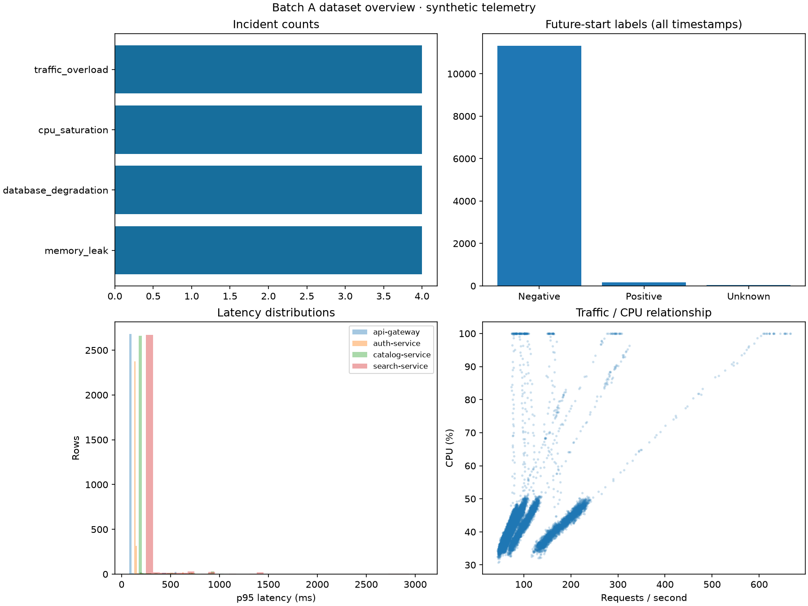
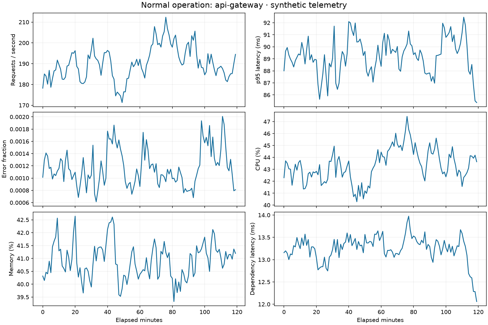
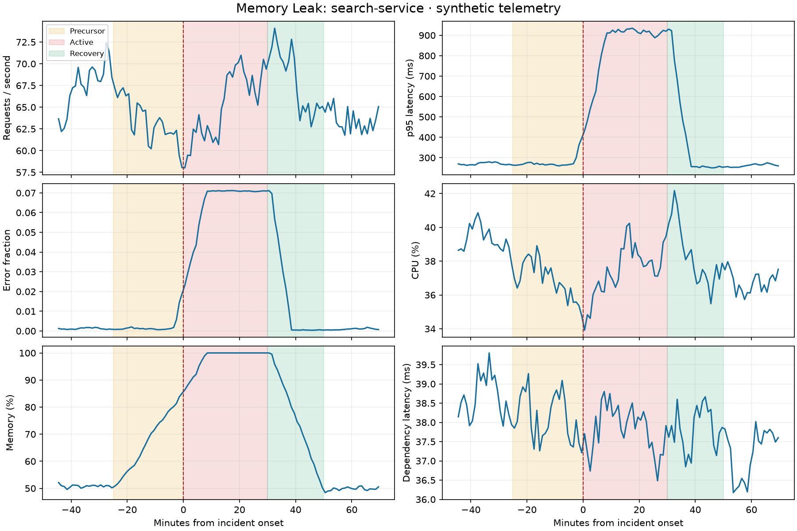
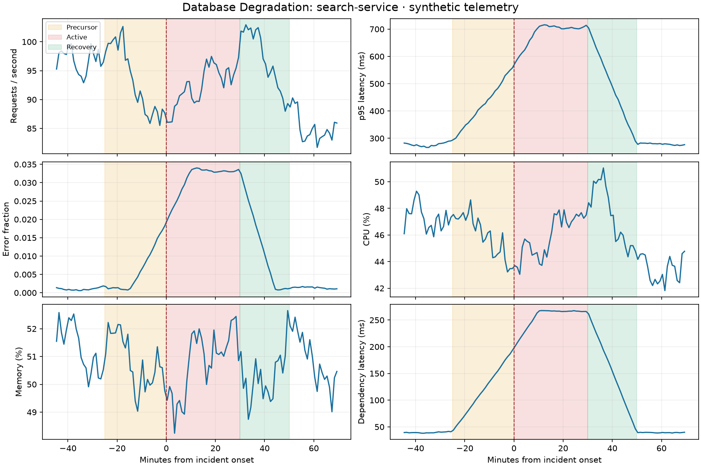
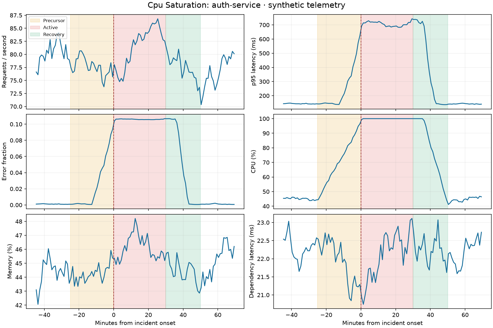
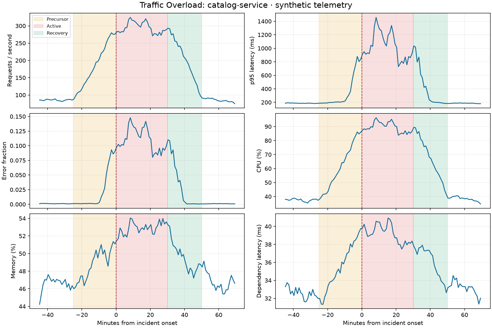
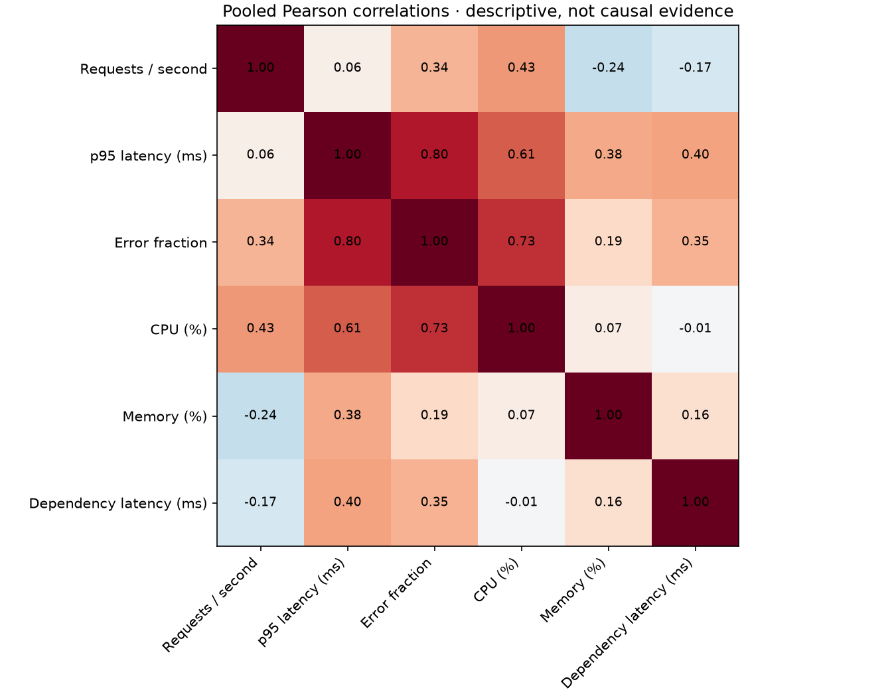

# Batch A simulation evidence

Generated from verified Parquet inputs. All data is synthetic.

- Telemetry rows: 11,520; services: 4.
- Incidents: 16; counts: {'cpu_saturation': 4, 'database_degradation': 4, 'memory_leak': 4, 'traffic_overload': 4}.
- Active duration (minutes): {'min': 30.0, 'mean': 30.0, 'max': 30.0}.
- Future labels: 160 positive, 11320 negative, 40 unknown.
- Positive fraction among observed labels: 0.013937282229965157.
- Complete history and horizon: 11420 rows.

## Review the data

## Interpretation and limits

Each scenario plot uses the earliest onset of that type, with 20-minute context. Shading is ground truth used only for review. Precursor and recovery slopes are visible before and after the active phase; exact phase means are in `example_phase_means.csv`. `incident_catalog.csv` contains every incident, and `descriptive_statistics.csv` includes per-service distributions.

The schedule deliberately covers scenarios; label prevalence is designed, not an estimate of production outages. Pooled correlations mix services and regimes. These plots demonstrate simulator mechanics, not real-world predictability. Onset marks an injected fault-pressure boundary, not a measured SLO violation. No model or forecasting performance is claimed. Source configuration, versions and hashes are recorded in `summary.json`.
