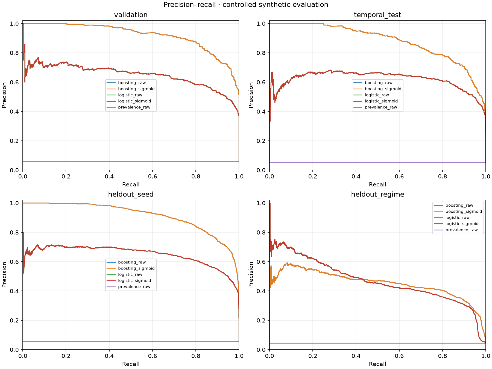
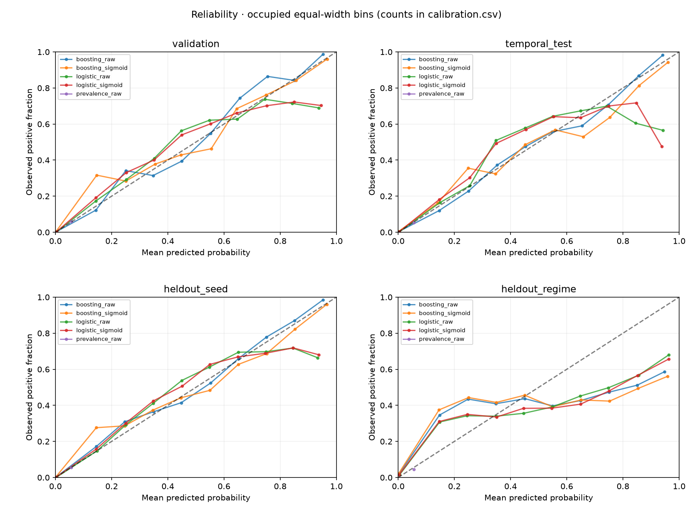
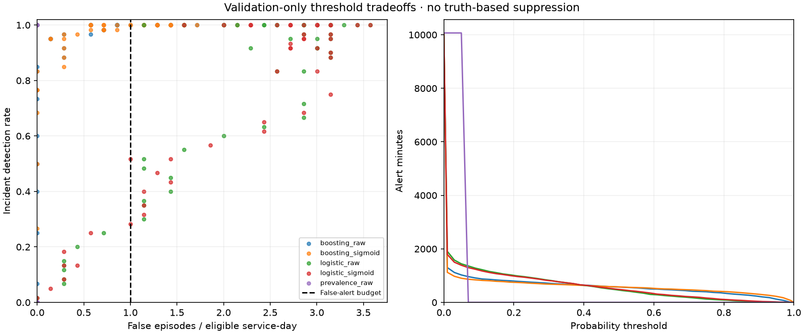
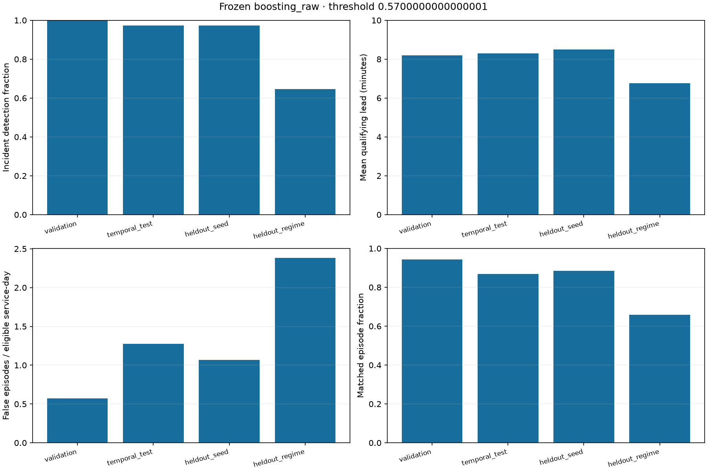
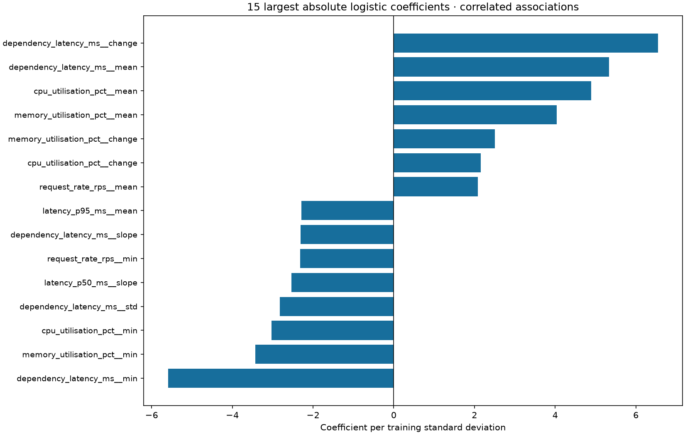

# Batch B — synthetic ML and evaluation evidence

Generated from saved outputs; no metrics are manually transcribed. This measures controlled synthetic feasibility, not production forecasting validity.

## Corpus and protocol

161280 telemetry rows; 846 incidents. Each run spans four days in the reference configuration.

| run_id | group | seed | duration_minutes | telemetry_rows | incidents |
| --- | --- | --- | --- | --- | --- |
| development-101 | development | 101 | 5760 | 23040 | 128 |
| development-202 | development | 202 | 5760 | 23040 | 128 |
| development-303 | development | 303 | 5760 | 23040 | 128 |
| heldout_seed-404 | heldout_seed | 404 | 5760 | 23040 | 128 |
| heldout_seed-505 | heldout_seed | 505 | 5760 | 23040 | 128 |
| heldout_regime-606 | heldout_regime | 606 | 5760 | 23040 | 103 |
| heldout_regime-707 | heldout_regime | 707 | 5760 | 23040 | 103 |

Development runs use chronological train / calibration / validation / temporal-test intervals. Exact boundaries and eligible row/positive counts are in boundaries.csv and splits.csv. First 15 minutes and final 10 minutes are purged per interval. Held-out seeds and renewal-like schedule regimes use full-run eligible coverage. All seven telemetry metrics have current/mean/population-std/min/max/change/slope features; no identity or clock predictors.

Onset counts by partition, service and type are in event_counts.csv; scorable event denominators below exclude events without any eligible pre-onset forecast minute. Partial forecast opportunities near purges remain scorable.

## Validation evidence and frozen choice

| candidate | average_precision | brier | log_loss |
| --- | --- | --- | --- |
| prevalence_raw | 0.0592967818831942 | 0.0557912669413941 | 0.2251265451694638 |
| logistic_raw | 0.649669510742927 | 0.0284355220930672 | 0.0863687755580196 |
| logistic_sigmoid | 0.6496695107429269 | 0.0284958167692455 | 0.0861419961120387 |
| boosting_raw | 0.9199532597153072 | 0.0140086187349396 | 0.0451852356072112 |
| boosting_sigmoid | 0.9199532597153072 | 0.0140657557762734 | 0.0452056071018858 |

Selected **boosting_raw**, threshold **0.5700000000000001**. Family: highest raw validation average precision; ties use log loss then name. Calibration: sigmoid only if validation Brier AND log loss strictly improve. Operating point: max detection within budget; tie: fewer alert minutes, then higher threshold; budget 1.0 false episodes per eligible service-day. Every candidate's threshold is frozen in selection.json before test scoring. No hyperparameter search; boosting early stopping is disabled.

## Frozen selected result

| partition | rows | positives | prevalence | average_precision | roc_auc | brier | log_loss | precision | recall |
| --- | --- | --- | --- | --- | --- | --- | --- | --- | --- |
| heldout_regime | 45880 | 2060 | 0.0448997384481255 | 0.4512755938169232 | 0.958559918554723 | 0.0349179175013834 | 0.1336770404590953 | 0.497787610619469 | 0.3276699029126214 |
| heldout_seed | 45880 | 2560 | 0.055797733217088 | 0.9133911284430838 | 0.9941826586666088 | 0.0138346471968064 | 0.0448832919864019 | 0.8591792656587472 | 0.776953125 |
| temporal_test | 13524 | 720 | 0.0532386867790594 | 0.8800795523231142 | 0.9918967922350654 | 0.0158477733397037 | 0.0518405988851651 | 0.8152173913043478 | 0.7291666666666666 |
| validation | 10068 | 597 | 0.0592967818831942 | 0.9199532597153072 | 0.9945472266835178 | 0.0140086187349396 | 0.0451852356072112 | 0.8835877862595419 | 0.7755443886097152 |

## Incident detection and operational burden

| partition | scorable_incidents | detected_incidents | missed_incidents | mean_lead_minutes | false_alerts_per_service_day | alert_precision | episodes | alert_minutes | eligible_service_days |
| --- | --- | --- | --- | --- | --- | --- | --- | --- | --- |
| heldout_regime | 206 | 133 | 73 | 6.760603341854637 | 2.3853530950305144 | 0.6576576576576577 | 222 | 1356 | 31.86111111111111 |
| heldout_seed | 256 | 249 | 7 | 8.50489691900937 | 1.0671316477768091 | 0.8851351351351351 | 296 | 2315 | 31.86111111111111 |
| temporal_test | 72 | 70 | 2 | 8.29760032904762 | 1.277728482697427 | 0.8695652173913043 | 92 | 644 | 9.391666666666667 |
| validation | 60 | 60 | 0 | 8.199379172222221 | 0.5721096543504172 | 0.9428571428571428 | 70 | 524 | 6.991666666666666 |

An episode groups consecutive above-threshold eligible service minutes within one run. It matches if any alerted minute precedes an onset by (0,10] minutes. Lead time uses the earliest qualifying minute, not an earlier out-of-window episode start. False episodes have no match. Alert minutes include active/recovery periods; no truth-based suppression occurs. Exposure is eligible minutes / 1440.

The false-episode budget alone can admit always-on forecasts: their long episodes match events while consuming all eligible minutes. The baseline/logistic selected points exhibit this weakness; read their recall alongside burden and row precision. This rule was not revised after viewing holdouts. A future protocol needs a hard burden constraint and fresh holdouts.

## All candidates, including untouched evaluations

| partition | candidate | threshold | average_precision | brier | log_loss | incident_detection_rate | false_alerts_per_service_day |
| --- | --- | --- | --- | --- | --- | --- | --- |
| heldout_regime | boosting_raw | 0.5700000000000001 | 0.4512755938169232 | 0.0349179175013834 | 0.1336770404590953 | 0.6456310679611651 | 2.3853530950305144 |
| heldout_regime | boosting_sigmoid | 0.61 | 0.4512755938169232 | 0.0367328906790642 | 0.1647566115393135 | 0.6456310679611651 | 2.3853530950305144 |
| heldout_regime | logistic_raw | 0.0 | 0.4695186171673465 | 0.0327991515474474 | 0.1187862679941769 | 1.0 | 0.0 |
| heldout_regime | logistic_sigmoid | 0.0 | 0.4695186171673465 | 0.0334364390421758 | 0.1250528279046412 | 1.0 | 0.0 |
| heldout_regime | prevalence_raw | 0.05 | 0.0448997384481255 | 0.0430079026303961 | 0.1844695872279436 | 1.0 | 0.0 |
| heldout_seed | boosting_raw | 0.5700000000000001 | 0.9133911284430838 | 0.0138346471968064 | 0.0448832919864019 | 0.97265625 | 1.0671316477768091 |
| heldout_seed | boosting_sigmoid | 0.61 | 0.9133911284430838 | 0.0140139630707362 | 0.0456645747117654 | 0.97265625 | 1.129904097646033 |
| heldout_seed | logistic_raw | 0.0 | 0.648722363282569 | 0.0261901430007157 | 0.0804610539168449 | 1.0 | 0.0 |
| heldout_seed | logistic_sigmoid | 0.0 | 0.648722363282569 | 0.0262642322941848 | 0.0803067905168361 | 1.0 | 0.0 |
| heldout_seed | prevalence_raw | 0.05 | 0.055797733217088 | 0.0526844058665853 | 0.215245302878655 | 1.0 | 0.0 |
| temporal_test | boosting_raw | 0.5700000000000001 | 0.8800795523231142 | 0.0158477733397037 | 0.0518405988851651 | 0.9722222222222222 | 1.277728482697427 |
| temporal_test | boosting_sigmoid | 0.61 | 0.8800795523231142 | 0.0161354597091401 | 0.0543745813726142 | 0.9722222222222222 | 1.277728482697427 |
| temporal_test | logistic_raw | 0.0 | 0.6195886645910931 | 0.0259122402153157 | 0.0790476595918773 | 1.0 | 0.0 |
| temporal_test | logistic_sigmoid | 0.0 | 0.6195886645910931 | 0.025996487794858 | 0.0790518583412964 | 1.0 | 0.0 |
| temporal_test | prevalence_raw | 0.05 | 0.0532386867790594 | 0.0504121877508576 | 0.2080186077679147 | 1.0 | 0.0 |
| validation | boosting_raw | 0.5700000000000001 | 0.9199532597153072 | 0.0140086187349396 | 0.0451852356072112 | 1.0 | 0.5721096543504172 |
| validation | boosting_sigmoid | 0.61 | 0.9199532597153072 | 0.0140657557762734 | 0.0452056071018858 | 1.0 | 0.5721096543504172 |
| validation | logistic_raw | 0.0 | 0.649669510742927 | 0.0284355220930672 | 0.0863687755580196 | 1.0 | 0.0 |
| validation | logistic_sigmoid | 0.0 | 0.6496695107429269 | 0.0284958167692455 | 0.0861419961120387 | 1.0 | 0.0 |
| validation | prevalence_raw | 0.05 | 0.0592967818831942 | 0.0557912669413941 | 0.2251265451694638 | 1.0 | 0.0 |

## Uncertainty and service diagnostics

uncertainty.json contains seeded 200-resample percentile intervals using whole independent simulation runs. Two held-out runs and three development runs make these intervals coarse and unstable; they do not quantify real-world uncertainty. Per-service results are in service_metrics.csv. Identity is excluded, but metric baselines can still proxy service. The holdout changes schedules within the same four profiles and does not establish generalisation to unseen services.

## Figures

Average precision is the primary step-weighted PR-area summary (not trapezoidal interpolation). Reliability points show occupied equal-width probability bins; bin counts are in calibration.csv. Coefficients describe the training-fitted standardised logistic model, even if another model is selected. Correlated features make them unstable associations, not causal importance.

## Reproduction and limitations

Run `reliability batch-b --config configs/batch_b.json --corpus data/batch_b --output data/batch_b_experiment --evidence evidence/batch_b/generated` from the repository root after installing requirements-lock.txt. Use new output/evidence paths for repeat runs; existing corpus bundles are strictly verified and reused. `reliability batch-b-evidence --experiment data/batch_b_experiment --output evidence/batch_b/repeated` regenerates compact evidence without fitting.

Source hashes, dependency versions, seeds and immutable source manifests accompany this report. Raw tables, assignments, fitted trusted-local joblib models and all candidate row predictions remain in the ignored experiment directory.

The reference corpus provides hundreds of controlled events across seeds for a small fixed candidate comparison, but events share simulator equations, smooth precursors, profiles and noise assumptions. It lacks abrupt unforeseeable faults, benign precursor lookalikes, missing/late data, unseen services and external telemetry. Schedule holdout shifts arrival spacing, type frequencies, durations and severity together; it cannot attribute degradation to one factor. No simulator equations were tuned. Results must not be described as production readiness or real-world forecasting. Remote CI is not claimed. API, persistence and online serving remain deferred to Batch C.
