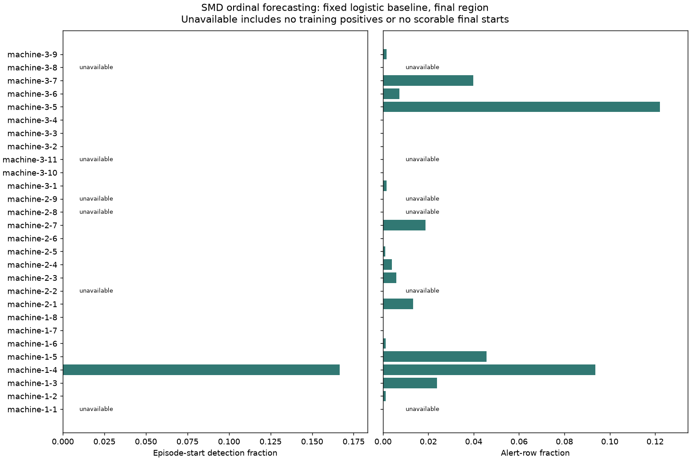

# SMD external forecasting study

This is a separate ordinal forecasting study, not validation of the production model or real
ten-minute incident warning. Machines are entity proxies, anomalies are not service incidents,
and the 38 anonymous normalized dimensions have no mapping to the seven production metrics.
Cadence is insufficiently documented; every horizon and lead is in samples/steps.

All 28 machines are included. The provider's labelled **test** sequences are repurposed into
chronological 50% development-training, 20% selection-validation and 30% final regions. Official
train files are validated and hashed but not fitted here: they lack the labels needed for this
supervised task. Full observation/target windows are purged at every boundary. Features are only
current values and preceding-15-step means. Consecutive positive labels collapse to episodes;
targets indicate starts in `(t,t+10 steps]`; final ten rows are censored. Point and
interpretation labels are never features, and machine IDs only group separate models.

Protocol fixed before final scoring: per-machine training-fitted standardization and L2 logistic
C=1, maximum 2000 iterations, seed 2026; training prevalence comparator; threshold 0.5 for both.
No family, threshold or hyperparameter selection. Validation is diagnostic. Six one-class
training regions cannot fit logistic; their results are unavailable, not excluded from the
dataset. Pooled logistic and prevalence denominators therefore differ and are displayed
explicitly.

## Final results

| Family | Machines | Rows | Positives | AP | Brier | Detected/scorable | False episodes | Alerts |
| --- | ---: | ---: | ---: | ---: | ---: | ---: | ---: | ---: |
| logistic | 22 | 163383 | 850 | 0.005968969761866583 | 0.01979257913732064 | 1/85 | 424 | 2777 |
| prevalence | 28 | 211836 | 1080 | 0.006867663858818051 | 0.005076096241602803 | 0/108 | 0 | 0 |

Logistic unavailable (no training positive starts): machine-1-1, machine-2-2, machine-2-8, machine-2-9, machine-3-11, machine-3-8.

Final regions with no scorable starts: .
AP, recall and detection use null where undefined. Full per-machine metrics, class balance, lead steps and validation results are in `per_machine.csv` and `results.json`.

The weak final results expose domain and temporal mismatch. Sparse episode starts differ from point-anomaly prevalence; long anomalies contribute only one start. The fixed threshold misses nearly all starts, while logistic false alerts persist. This supports reproducibility of the forecasting/evaluation method and exposes its limitations; it supports neither useful real-world warning nor transfer of the frozen synthetic model. SMD scores must not be numerically compared with Batch B scores as the same task. No production model was loaded or modified in this study.

Source pin, dataset-specific MIT licence hash and all 84 consumed file hashes/shapes are in `source.json`; fixed protocol in `protocol.json`. Regeneration is deterministic in the recorded numerical environment; download timestamp and environment source paths are provenance fields.
